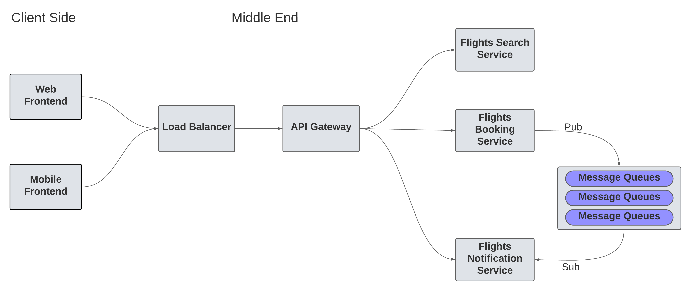

# Flight Notification Service

<h3>Introduction</h3>

    The Flights Notification Service is a microservice responsible for sending notifications to users in the Flight Ticket Booking system. It uses RabbitMQ, a message broker based on the pub-sub architecture, to manage communication between different services and delivers email notifications through Nodemailer.

**High Level Design of the Project**

**Schema of the Notification Service**

**High level flow of the project**

We set up mailing service by using the nodemailer package. We identified and implemented the schema for the 'Tickets' models. We set up business logic to find all pending email tickets. We run a a cron job to check for all tickets in PENDING state and initiate an email to the recipients. 