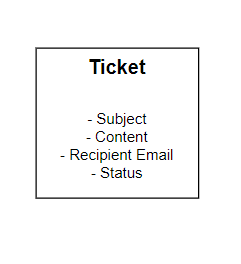

# Flight Notification Service

<h3>Introduction</h3>

    The Flights Notification Service is a microservice responsible for sending notifications to users in the Flight Ticket Booking system. It uses RabbitMQ, a message broker based on the pub-sub architecture, to manage communication between different services and delivers email notifications through Nodemailer.

**High Level Design of the Project**

**Schema of the Notification Service**

**Some of the screenshots from this service are as follows:**

1. RabbitMQ Management Console, which shows details like message send rate, consumer details, consumer ACK rates etc.

2. Booking confirmation sent to the user on successful booking:

